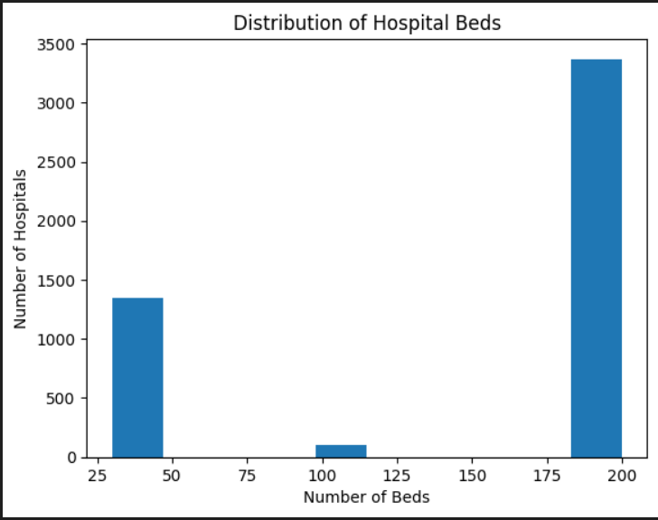

# Hospital Infrastructure & Resource Analysis (Python) 🏥

## Project Overview
This project analyzes hospital infrastructure data to assess healthcare capacity
across cities and identify under-resourced regions using Python-based data analysis.

## Tools & Technologies
- Python
- Pandas
- Matplotlib
- Jupyter Notebook

## Key Analysis Performed
- Data cleaning and standardization
- Handling missing bed values using median imputation
- Feature engineering for hospital size classification
- City-level KPI calculation
- Identification of healthcare infrastructure gaps
- Exploratory Data Analysis and visualization

## Visualizations

## Key Insights
- Several cities have low bed-to-hospital ratios
- Government hospitals generally have higher bed capacity
- Bed distribution across cities is highly skewed

## Conclusion
This project demonstrates Python-based data cleaning, EDA, feature engineering,
and business insight generation in a healthcare analytics context.
